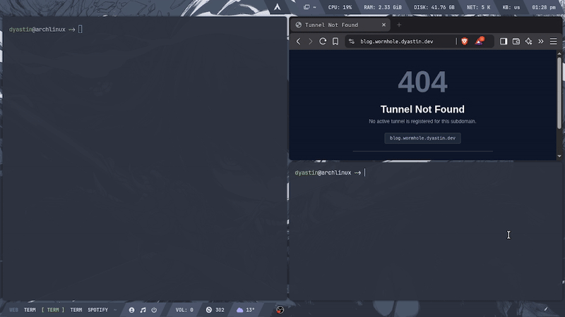

# Wormhole

A TCP-based reverse tunnel service written in Go.

## Installation

### From Source
```bash
git clone https://github.com/Dyastin-0/wormhole.git
cd wormhole
go install .
```

### Using Go Install
```bash
go install github.com/Dyastin-0/wormhole@latest
```

## Usage

### Running a Server

Running a server requires a wildcard domain (e.g., `*.wormhole.dev`) and its base domain pointed to the wormhole server. You'll need to configure a reverse proxy that supports wildcards.

Configuration can be loaded in multiple ways:

#### Environment Variables (Recommended)

The safest approach is to use environment variables. See `.example.env` for reference. If running the server as a systemd service, inject your `.env` file via:
```ini
EnvironmentFile=/path/to/wormhole/.env
```

#### Config File

Store a configuration file at the default path (see `DefaultConfigPath` in `wormhole.go`) to automatically load settings. See `example.config.yaml` for reference.

#### CLI Flags
```bash
wormhole start \
    --secret <api-key-secret> \
    --domain <base-domain-for-tunnels> \
    --address <:port-number> \
    --serve-address <:port-number>
```

**Flag Descriptions:**

- `--address`: TCP server address for handling Wormhole client connections
- `--serve-address`: TLS server address that routes connections to configured tunnels based on SNI
- `--secret`: Secret key used to generate and validate API keys
- `--domain`: Base domain for tunnels (e.g., `wormhole.dev` with wildcard `*.wormhole.dev` for tunnel clients)

If using environment variables or a config file, simply run:
```bash
wormhole start
```

For custom config paths:
```bash
wormhole start --config-path "/path/to/config.yaml"
```

### Creating Tunnels

#### Basic HTTP Tunnel

Create a tunnel by specifying your desired subdomain, target address, and wormhole server address:
```bash
wormhole http \
    --name <subdomain> \
    --target-address <:port-number> \
    --address <wormhole.server.address:443>
```

If `--address` is omitted, the client connects to the default server at `wormhole.dyastin.dev:443`.

#### TCP Tunnel
```bash
wormhole tcp \
    --name <subdomain> \
    --target-address <:port-number> \
    --address <wormhole.server.address:443>
```

By default, TCP tunnels block HTTP traffic for security. To allow HTTP traffic on a TCP tunnel, use the `--allow-http` flag:
```bash
wormhole tcp \
    --name <subdomain> \
    --target-address <:port-number> \
    --address <wormhole.server.address:443> \
    --allow-http
```

This is useful when you want to tunnel HTTP applications through a TCP tunnel or need the flexibility of raw TCP with optional HTTP support.

### Monitoring and Observability

#### Metrics

Enable real-time metrics streaming to monitor your tunnel's performance:
```bash
wormhole http \
    --name <subdomain> \
    --target-address <:port-number> \
    --metrics
```

Displays:
- Ingress/egress bandwidth and rates
- Active and total connections
- Tunnel uptime
- Round-trip time (RTT)

#### HTTP Request Logging

Enable HTTP request logging to see all incoming requests in real-time:
```bash
wormhole http \
    --name <subdomain> \
    --target-address <:port-number> \
    --http-log
```

Displays each HTTP request with:
- Timestamp
- HTTP method (GET, POST, etc.)
- Path
- Status code
- Response time

HTTP logging works with both HTTP tunnels and TCP tunnels that have `--allow-http` enabled:
```bash
wormhole tcp \
    --name <subdomain> \
    --target-address <:port-number> \
    --allow-http \
    --http-log
```

#### Combined Monitoring

Enable both metrics and HTTP logging for comprehensive observability:
```bash
wormhole http \
    --name <subdomain> \
    --target-address <:port-number> \
    --metrics \
    --http-log
```

#### Tunnel Authentication

Wormhole supports authentication to restrict access to your tunnels. You can protect tunnels with either Basic Auth or Bearer token authentication.

##### Basic Authentication
```bash
wormhole http \
    --name <subdomain> \
    --target-address <:port-number> \
    --auth-type basic \
    --auth-user <username> \
    --auth-password <password>
```

Clients accessing this tunnel will be prompted for credentials. Example curl request:
```bash
curl -u username:password https://<subdomain>.wormhole.dev
```

##### Bearer Token Authentication
```bash
wormhole http \
    --name <subdomain> \
    --target-address <:port-number> \
    --auth-type bearer \
    --auth-token <your-secret-token>
```

Clients must include the bearer token in the Authorization header:
```bash
curl -H "Authorization: Bearer <your-secret-token>" https://<subdomain>.wormhole.dev
```

##### No Authentication

To explicitly disable authentication (default behavior):
```bash
wormhole http \
    --name <subdomain> \
    --target-address <:port-number> \
    --auth-type none
```

### API Key Management

#### Generating a Secret

First, generate a signing secret for API key generation:
```bash
wormhole admin generate-secret --length 32
```

Store this secret securely and set it as the `WORMHOLE_SECRET` environment variable or in your config file.

#### Issuing API Keys

Issue API keys to grant clients extended tunnel lifetimes:
```bash
wormhole admin issue-token --expires 30d --ttl 4
```

**Parameter Descriptions:**

- `--expires`: JWT expiration duration (e.g., `30d`, `720h`, `1y`)
- `--ttl`: Time-to-live in hours for tunnels created with this key

**TTL Behavior:**

- **Fixed TTL** (TTL > 0): Tunnels will have the specified TTL (e.g., `--ttl 4` creates tunnels with 4-hour lifetimes)
- **Flexible TTL** (TTL = 0): Clients can specify their own `--ttl` value up to a server-defined maximum
- **No API Key**: Clients without an API key default to 1-hour tunnel lifetimes

#### Using API Keys
```bash
wormhole http \
    --name <subdomain> \
    --target-address <:port-number> \
    --api-key <api-key> \
    --ttl 24
```

If `--ttl` is omitted when using an API key, the tunnel defaults to 1 hour unless the key has a specific TTL claim.

### Complete Example with Authentication and Monitoring

Create an authenticated tunnel with metrics and HTTP logging:
```bash
wormhole http \
    --name myapp \
    --target-address :3000 \
    --address wormhole.dyastin.dev:443 \
    --api-key eyJhbGciOiJIUzI1NiIsInR5cCI6IkpXVCJ9... \
    --ttl 24 \
    --auth-type bearer \
    --auth-token my-secret-token-123 \
    --metrics \
    --http-log
```

Access the tunnel:
```bash
curl -H "Authorization: Bearer my-secret-token-123" https://myapp.wormhole.dyastin.dev
```

### TCP Tunnel with HTTP Support, Authentication, and Logging

Create a TCP tunnel that allows HTTP traffic with authentication and request logging:
```bash
wormhole tcp \
    --name secure-app \
    --target-address :8080 \
    --address wormhole.dyastin.dev:443 \
    --allow-http \
    --auth-type basic \
    --auth-user admin \
    --auth-password secret123 \
    --http-log
```

Access the tunnel:
```bash
curl -u admin:secret123 https://secure-app.wormhole.dyastin.dev
```

## Demo


